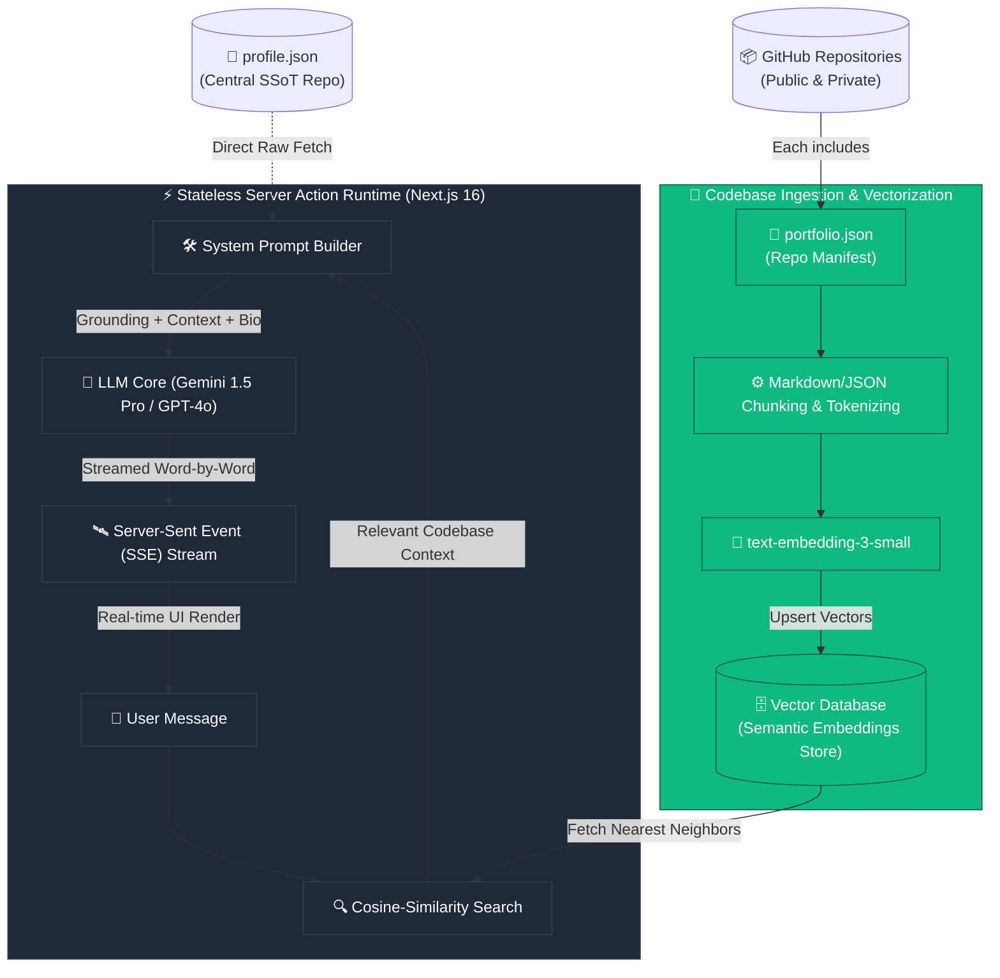

# 🤖 YlyaBot — AI Digital Twin (Work in Progress)

<div align="center">
  

  <h3>🧠 RAG-Powered Conversational Engine • Centralized SSoT Grounding • Multi-Repo Vector Ingestion</h3>

  <p>
    <strong>YlyaBot</strong> is a state-of-the-art AI Digital Twin and interactive virtual concierge. Built on a serverless, highly optimized vector retrieval architecture, it is designed to represent my professional philosophy, engineering decisions, and codebase architectures with 100% factual accuracy and zero hallucination.
  </p>

  <p align="center">
    <a href="https://www.hy13dev.com/ylya-bot"></a>
    <a href="https://github.com/HoodieYlya13/portfolio"></a>
    <a href="https://raw.githubusercontent.com/HoodieYlya13/HoodieYlya13/main/profile.json"></a>
  </p>
</div>

---

## 🏗️ System Architecture & RAG Pipeline

YlyaBot does not rely on generic pre-trained LLM assumptions. Instead, it utilizes a dual-layer grounding architecture combining **Stateless System Prompt Injection** (for personal bio/timeline data) and a **Multi-Repository Vector RAG Corpus** (for deep code questions).



---

## 🧬 How the LLM is "Ragged" (Deep Technical Breakdown)

To avoid feeding thousands of lines of raw source files into an LLM context, which degrades retrieval precision and inflates latency, YlyaBot uses a highly structured **Repository-to-Vector (R2V) Corpus Ingestion Pipeline**.

### 1. The Repository Manifest: `portfolio.json`
Every repository across my GitHub account contains an exhaustive, standardized `portfolio.json` file in its root directory. This manifest acts as a structured semantic blueprint of the repository:

```json
{
  "repository": "schumacher-knepper-theme-dev",
  "domain": "E-Commerce Frontend & Theme Engine",
  "architectural_style": "Modular Liquid Layout with Tailwind CSS & Alpine.js",
  "key_decisions": [
    {
      "decision": "Tailwind Integration in Shopify Liquid",
      "rationale": "Decoupled CSS builds in theme layouts to allow utility-first styling without impacting page-speed budgets."
    }
  ],
  "codebase_vectors": {
    "routing": "Custom Shopify dynamic routing templates",
    "state_management": "Alpine.js reactive stores for shopping cart overlays",
    "critical_components": [
      {
        "name": "AddToCartButton.tsx",
        "description": "Uses reactive subscriptions to switch labels to 'S'abonner' for recurring plans."
      }
    ]
  }
}
```

### 2. Chunking & Embedding Pipeline (CI/CD)
When a repository is updated, a custom GitHub action:
1. Validates the `portfolio.json` schema.
2. Extracts its metadata and creates semantic paragraphs pairing the *Context* with *Key Architectural Rationale*.
3. Generates high-dimension vector embeddings using the `text-embedding-3-small` model.
4. Upserts these embeddings into our serverless vector store, categorized under metadata tags corresponding to the specific repository ID.

### 3. Real-time Semantic Retrieval
When a user asks a deep technical question (e.g., *"How did you build the subscription flow in your Shopify dev theme?"*):
1. **Query Vectorization:** The user’s input is converted into a vector embedding.
2. **Similarity Search:** A Cosine-Similarity search query is dispatched to the vector database to retrieve the top 3 most relevant segments of `portfolio.json` across all repositories.
3. **Context Construction:** The system combines:
   - The global biological grounding from the raw [`profile.json`](https://github.com/HoodieYlya13/HoodieYlya13/blob/main/profile.json) SSoT.
   - The targeted semantic chunks retrieved from the `portfolio.json` corpus.
4. **Execution:** The grounded prompt is sent to the LLM core, ensuring it speaks of my codebases with total engineering accuracy.

---

## ⚡ Next.js 16 & React 19 Implementation

YlyaBot’s interface is built directly inside a Next.js 16 App Router structure to leverage modern network boundaries and streaming capabilities.

### 🔄 Asynchronous Data Access Layer & PPR
YlyaBot utilizes Next.js 16 **Partial Prerendering (PPR)** to instantly serve a static container shell while progressively streaming context-driven data and prompt configurations. 

Requests for system contexts dynamically fetch the centralized profile SSoT via highly optimized Edge fetches using React 19's native `'use cache'` directive:

```typescript
// app/ylya-bot/actions.ts
"use server";

import { cache } from "react";

// Cache grounded profile context for 1 hour to ensure ultra-low TTFB
export const getSystemGroundingContext = cache(async () => {
  const SSoT_URL = "https://raw.githubusercontent.com/HoodieYlya13/HoodieYlya13/main/profile.json";
  
  const res = await fetch(SSoT_URL, {
    next: { revalidate: 3600 }
  });
  
  if (!res.ok) {
    throw new Error("Unable to fetch SSoT grounding profile.");
  }
  
  return await res.json();
});
```

### 💬 React 19 Forms & Streamed Responses
Interaction with YlyaBot is built with zero raw `useEffect` fetches, relying strictly on **React 19 Server Actions** and **Vercel AI SDK UI Hooks** to stream responses chunk-by-chunk:

```tsx
// app/ylya-bot/ChatForm.tsx
"use client";

import React, { useActionState } from "react";
import { Send } from "lucide-react";

interface ChatState {
  messages: Array<{ sender: "user" | "bot"; text: string }>;
  error?: string;
}

export function ChatForm({ onSubmitAction }: { onSubmitAction: (state: ChatState, formData: FormData) => Promise<ChatState> }) {
  const [state, formAction, isPending] = useActionState(onSubmitAction, { messages: [] });

  return (
    <form action={formAction} className="flex gap-2">
      <input
        type="text"
        name="message"
        required
        placeholder="Ask YlyaBot about my engineering background..."
        className="flex-1 px-4 py-3 rounded-xl bg-card border text-foreground focus:ring-1 focus:ring-apple-orange/20"
      />
      <button
        type="submit"
        disabled={isPending}
        className="px-5 bg-apple-orange disabled:opacity-40 rounded-xl flex items-center justify-center transition-all cursor-pointer"
      >
        <Send className="size-4" />
      </button>
    </form>
  );
}
```

---

## 🎨 Premium Apple Design Aesthetics

The user interface follows the premium **Apple Design Aesthetic** present across the entire portfolio site:
- **Liquid Glassmorphism:** Cards leverage high-blur translucent overlays (`backdrop-blur-xl bg-card/30 border-border/60`) for a unified premium dark/light mode experience.
- **Strict Color Tokens:** Only utilizes established brand colors to express system states (`--apple-orange` for primary interactive states, `--apple-green` for live service status indicators, `--apple-blue` for syntax tags).
- **A11y Compliant:** High-contrast text readability matching modern WCAG AA guidelines.

---

<div align="center">
  <sub>YlyaBot AI Engine • Created with ❤️ and precision • Centralized SSoT v1.4.2</sub>
</div>