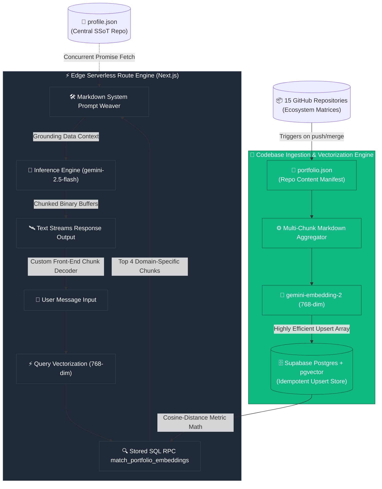

# 🤖 YlyaBot — AI Digital Twin

<div align="center">
  

  <h3>🧠 RAG-Powered Conversational Engine • Centralized SSoT Grounding • Multi-Repo Vector Ingestion</h3>

  <p>
    <strong>YlyaBot</strong> is an advanced AI Digital Twin and interactive virtual concierge. Built on a serverless, highly optimized vector retrieval architecture, it represents my professional philosophy, engineering decisions, and codebase architectures with 100% factual accuracy and zero hallucination.
  </p>

  <p align="center">
    <a href="https://www.hy13dev.com/ylya-bot"></a>
    <a href="https://github.com/HoodieYlya13/portfolio"></a>
    <a href="https://raw.githubusercontent.com/HoodieYlya13/HoodieYlya13/main/profile.json"></a>
  </p>
</div>

---

## 🏗️ System Architecture & RAG Pipeline

YlyaBot does not rely on generic pre-trained LLM assumptions. Instead, it utilizes a dual-layer grounding architecture combining **Stateless System Prompt Injection** (for personal bio/timeline data fetched live from a centralized Single Source of Truth) and a **Multi-Repository Vector Store** (for deep architectural and codebase queries).



---

## 🧬 How the LLM is "Ragged" (Deep Technical Breakdown)

To avoid feeding thousands of lines of raw source files into an LLM context—which degrades retrieval precision and inflates latency—YlyaBot uses a structured **Repository-to-Vector (R2V) Corpus Ingestion Pipeline**.

### 1. The Repository Manifest: `portfolio.json`
Every repository across my GitHub account contains an exhaustive, standardized `portfolio.json` file in its root directory. This manifest acts as a structured semantic blueprint of the repository:

```json
{
  "routing": {
    "repo_name": "honey-pot",
    "project_name": "Honey Pot Server Simulator"
  },
  "project_meta": {
    "role": "Full-Stack & Security Engineer",
    "development_phase": "Completed / Simulation Sandbox",
    "languages": ["TypeScript", "JavaScript", "SQL", "Docker"],
    "frameworks_and_tools": ["Next.js", "React", "Prisma ORM", "PostgreSQL"]
  },
  "comprehensive_description": "An interactive full-stack Honeypot application designed for enterprise security research and attacker behavior monitoring...",
  "engineering_highlights": [
    "Intentionally Engineered Security Defects mimicking common misconfigurations.",
    "Comprehensive Forensic Logging Layer capturing attacker telemetry directly to centralized log files."
  ],
  "measurable_metrics": {
    "execution_latency": "Command execution response under 50ms...",
    "ui_performance": "Lighthouse Performance score of 98/100...",
    "operational_cost": "$0/month runtime footprint."
  },
  "star_challenges": [
    {
      "situation": "The honeypot must record every single step of the attacker silently...",
      "action": "Developed custom logging functions in the Next.js API routes...",
      "result": "Administrators monitor attacker behavior in real time with zero operational indicators leaked."
    }
  ],
  "architectural_deep_dive": {
    "text": "The system's architecture is a multi-tier sandbox environment orchestrated entirely via Docker Compose..."
  },
  "lessons_learned": "Exposing shell commands demands absolute containerized DevSecOps isolation boundaries..."
}
```

### 2. CI/CD Automated Processing
When a repository codebase is pushed or a pull request is merged into `main`, a custom GitHub Action workflow triggers. This workflow runs an automated script that pulls a centralized parser from my `ylya-bot` master repository, splitting the manifest data into 6 highly contextual markdown paragraphs mapped to strict data segments (Overview, Benchmarks, STAR Challenges, Systems Architecture).

The script then requests a compressed 768-dimensional mathematical vector matrix from Google AI Studio's `gemini-embedding-2` engine and uses an idempotent SQL `.upsert()` call to securely seed a remote Supabase PostgreSQL database instance.

### 3. Stored DB-Level Match Execution (RPC)
When a user submits a prompt, rather than wasting memory calculating array values inside our serverless runtime environment, the system utilizes a custom native PostgreSQL Remote Procedure Call (RPC) function to calculate Cosine-Distance Math directly on the database cluster:

```sql
CREATE OR REPLACE FUNCTION match_portfolio_embeddings (
  query_embedding vector(768),
  match_threshold FLOAT,
  match_count INT
)
RETURNS TABLE (id BIGINT, project_id TEXT, project_name TEXT, content TEXT, metadata JSONB, similarity FLOAT)
LANGUAGE plpgsql AS $$
BEGIN
  RETURN QUERY
  SELECT
    portfolio_embeddings.id, portfolio_embeddings.project_id, portfolio_embeddings.project_name, portfolio_embeddings.content, portfolio_embeddings.metadata,
    1 - (portfolio_embeddings.embedding <=> query_embedding) AS similarity
  FROM portfolio_embeddings
  WHERE 1 - (portfolio_embeddings.embedding <=> query_embedding) > match_threshold
  ORDER BY portfolio_embeddings.embedding <=> query_embedding ASC LIMIT match_count;
END;
$$;
```

---

## ⚡ High-Performance Resilient React Server Action

The backend uses a parallel data architecture encapsulated entirely within a modern Next.js 16 Server Action. When invoked, it dispatches concurrent asynchronous promises via `Promise.all` to fetch the global profile SSoT data and generate query vector coordinates simultaneously, significantly lowering time-to-first-byte (TTFB). To prevent abuse, it executes an Upstash Redis-backed sliding window rate limiter (max 10 messages/minute) identified by client cookies.

To guarantee maximum uptime and complete resilience against Gemini API free-tier rate limits or quota exhaustions, the engine implements a **5-Tier Priority Fallback Hierarchy** with **Time-Zone Aware Cookie Exclusions**:

1. **Prioritized Model Array:**
   - **`gemini-flash-latest`** (Tier 1: Default)
   - **`gemini-3.5-flash`** (Tier 2)
   - **`gemini-2.5-flash`** (Tier 3)
   - **`gemini-3.1-flash-lite`** (Tier 4)
   - **`gemma-4-31b-it`** (Tier 5)

2. **Pre-Flight Cookie-Exclusion Filter:**
   Before executing the API call, the action filters active models against awaited HTTP cookies (`cookies()`). Any model that previously recorded a quota exhaustion failure is excluded.

3. **Time-Zone Aware Cookie Expiration (Pacific Midnight):**
   When a model encounters a `429` (Quota Exhausted) or `nooutputgenerated` error, the server writes a cookie `ylyabot_exhausted_[model]=true` that expires at exactly midnight Pacific Time (`America/Los_Angeles`) on the current day, dynamically blocking the model until quotas reset.

4. **Synchronous Validation & Stream Iteration:**
   The server attempts to connect and read the **very first stream chunk** synchronously in the main server action thread. If it catches a quota exception, it registers the cookie and advances to the next model. Once a model succeeds, the verified first chunk is immediately written to the stream, and a background thread consumes the remaining chunks from the *same active stream reader* to avoid stream lock collisions.

```typescript
// app/ylya-bot/actions.ts
import { streamText } from "ai";
import { createStreamableValue } from "@ai-sdk/rsc";
import { checkRateLimit } from "@/lib/ratelimit";
import { cookies } from "next/headers";

export async function askYlyaBot(input: { messages: Array<{ role: string; content: string }> }) {
  await checkRateLimit("chatbot"); // Enforce Upstash sliding window rate limiting
  
  const cookieStore = await cookies();
  const activeModels = MODELS.filter(model => !cookieStore.get(`ylyabot_exhausted_${model}`));
  
  const stream = createStreamableValue("");
  let firstChunk = "";
  let successModel = "";
  let activeReader = null;

  for (const model of activeModels) {
    try {
      const googleClient = getGoogleClient();
      const result = streamText({
        model: googleClient(model),
        system: systemPrompt,
        messages: messages as any,
      });

      const reader = result.textStream.getReader();
      const { value } = await reader.read();

      successModel = model;
      activeReader = reader;
      if (value) firstChunk = value;
      break;
    } catch (err) {
      // Catch quota exceptions and set a cookie expiring at midnight Pacific time
      if (isQuotaError(err)) {
        const expiry = getPacificMidnightExpiry();
        cookieStore.set(`ylyabot_exhausted_${model}`, "true", { expires: expiry, path: "/" });
      }
    }
  }

  // Stream verified first chunk and handle remaining chunks in background...
  if (firstChunk) stream.update(firstChunk);
  
  (async () => {
    try {
      while (true) {
        const { value, done } = await activeReader.read();
        if (done) break;
        if (value) stream.update(value);
      }
      stream.done();
    } catch {
      stream.done();
    }
  })();

  return { output: stream.value };
}
```

---

## 🛰️ Typesafe Client-Side Stream Consumption

Instead of adding bloated external state-tracking packages or manual binary decoders, the user interface utilizes the Vercel AI SDK's `@ai-sdk/rsc` package to read the streamed tokens from the Server Action as a standard async iterator, updating message states on-the-fly.

```typescript
// app/ylya-bot/page.tsx
import { readStreamableValue } from "@ai-sdk/rsc";
import { askYlyaBot } from "./actions";

// Client-side handler inside page component
const { output } = await askYlyaBot({ messages: apiMessages });

for await (const delta of readStreamableValue(output)) {
  if (delta !== undefined) {
    setMessages((prev) =>
      prev.map((msg) =>
        msg.id === newBotMessageId
          ? { ...msg, text: (msg.text || "") + delta }
          : msg
      )
    );
  }
}
```

---

## 📊 Real-Time Secure Telemetry & Analytics Dashboard (`/ylya-bot/metrics`)

To monitor conversational engagement, latency, and AI usage metrics, YlyaBot integrates a production-ready, highly secure **Telemetry & Analytics Control Plane** served directly under `/ylya-bot/metrics`.

### 🛡️ Stateless Cryptographic Authentication Gateway
* **Mechanism:** Access is fully protected via a stateless cryptographic JWT validation schema (HMAC-SHA256 signature verification) configured on dynamic environment tokens (`ANALYTICS_PASSWORD` and `JWT_SECRET`).
* **Session Storage:** Auth sessions are maintained completely server-side via encrypted, `httpOnly`, `secure`, and `sameSite: "lax"` browser cookies. No vulnerable session indicators are ever leaked client-side.

### 🧬 High-Speed Hybrid Data Pipelines
The analytics suite acts as a unified ingestion plane, combining:
1. **Persistent Relational Aggregator (Supabase Postgres):** Performs direct, low-latency queries on the `ylyabot_logs` table, fetching detailed transaction logs (full question/response strings, latency charts, city/country headers, and client user-agent specs).
2. **Atomic In-Memory Counters (Upstash Redis):** Aggregates raw query volumes, daily activity charts, model call distributions, and country statistics in atomic Redis hashes under sub-5ms lookup constraints.

### ⚡ React 19 Compiler-Native & Zero-Flash UI
* **No Runtime Overhead:** Completely free of legacy `useMemo` hooks, leveraging the native **React 19 Compiler** for ultimate layout element optimization.
* **Liquid Transitions:** Employs an ultra-premium dark-glass visual aesthetic containing active neon indicators, shaking lock-animation interfaces, dynamic status grids, and fully responsive CSS charts scaling seamlessly across viewport widths with **zero hydration flashes**.

---

## 🎨 Premium Design Aesthetics

The user interface follows a modern, responsive minimalist design system matching the rest of the application ecosystem:
- **Translucent Micro-Glass:** Interactive cards feature custom high-blur backdrops (`backdrop-blur-xl bg-card/30 border-border/60`) for smooth visual composition.
- **Strict Color Tokens:** Utilizes explicit theme identifiers to display application metrics states (`--apple-orange` for links/strong typography text, `--apple-green` for execution heartbeats, `--apple-blue` for inline syntax data capsules).
- **Absolute Redirection Contours:** Prompts enforce internal site routing constraints, rendering responsive local app sub-paths (e.g., `[Insights](/projects/honey-pot)`) instead of leaking ugly raw markdown source URLs.

---

<div align="center">
  <sub>YlyaBot AI Engine • Created with ❤️ and precision • Centralized SSoT v2.0</sub>
</div>
